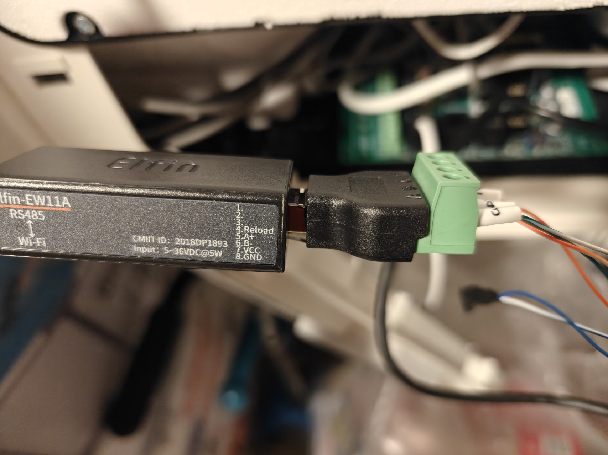
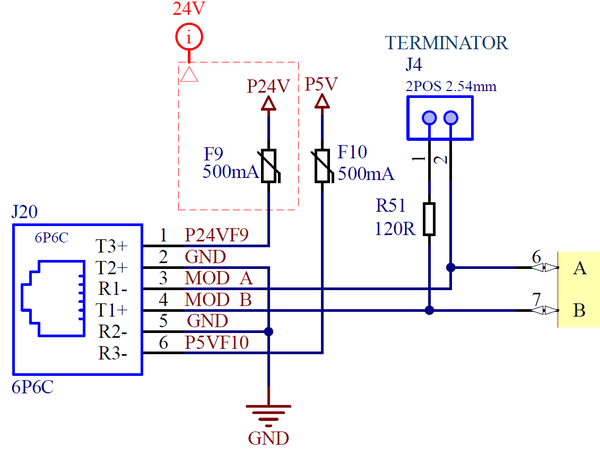
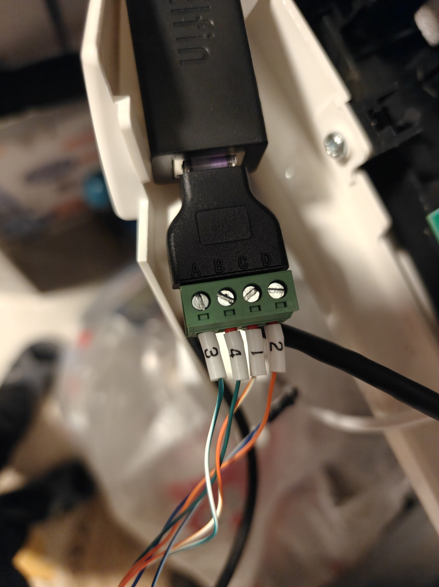
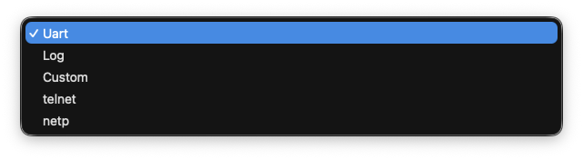
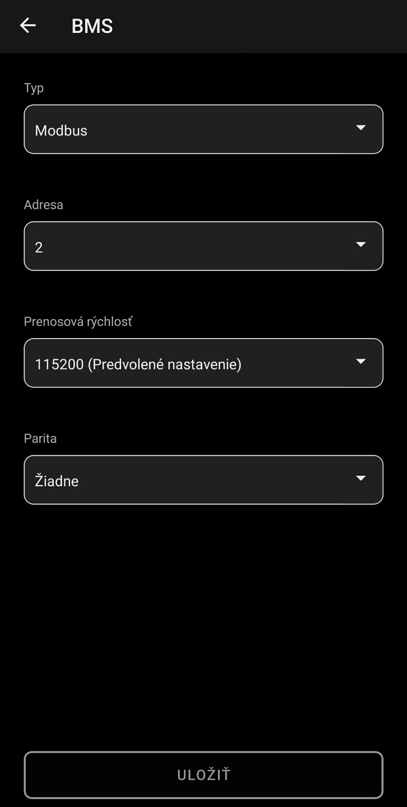
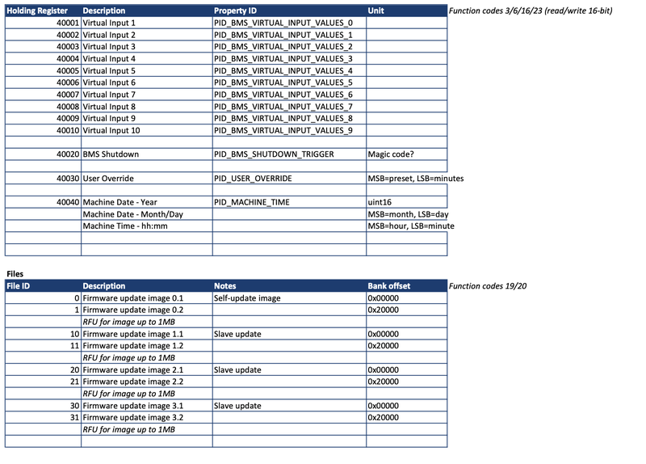

# ComAir HRUC-Plus Modbus Integration for Home Assistant

[](https://github.com/hacs/integration)
[](https://www.home-assistant.io/)

Custom Home Assistant integration for **ComAir HRUC-Plus 3** / **Vent-Axia Sentinel Kinetic Advance** MVHR ventilation units via Modbus RTU over TCP.

## Features

- **38 Entities**: Comprehensive sensor and control coverage
- **Config Flow UI**: Add via Settings → Integrations (no YAML editing)
- **BMS Settings**: Configuration matches Vent-Axia Connect app
- **Climate Control**: HVAC-like entity with preset modes
- **Energy Tracking**: Integrated energy sensor for HA Energy dashboard
- **Heat Recovery**: Calculated efficiency sensor
- **Translations**: English, Slovak, Czech

## Entities

| Platform | Count | Entities |
|----------|-------|----------|
| sensor | 20 | Temperatures (4), Humidity (2), CO2 (2), Fan RPM (2), Fan Speed % (2), Power, Energy, Heat Recovery, Timers (3), Diagnostics (3) |
| binary_sensor | 5 | Attention LED, Cooling Enable, Preheater Enable, Controlled Cooling/Heating |
| switch | 10 | Virtual Inputs 1-10 (BMS control mapping) |
| button | 1 | Sync Clock (write HA time to MVHR) |
| select | 1 | Ventilation Mode (Auto/Low/Medium/High/Boost) |
| number | 1 | Mode Duration (15-240 min, step 15) |
| climate | 1 | Ventilation with preset modes |

---

## Required Hardware

### 1. ComAir HRUC-Plus Ventilation Unit

The **ComAir HRUC-Plus 3** (also sold as **Vent-Axia Sentinel Kinetic Advance**) is a whole-house heat recovery ventilation unit (MVHR) with built-in Modbus RS485 support via the BMS connector.

**Supported models:**
| Device | Variants | Tested |
|--------|----------|--------|
| ComAir HRUC-Plus 3 | 250, 350 | 350 tested |
| Vent-Axia Sentinel Kinetic Advance | 250S/SX, 350S/SX (LH/RH) | 350SX RH tested |
| Vent-Axia Sentinel Kinetic Apex | Gen V | Should work (same Modbus map) |

### 2. Modbus RTU to TCP Gateway

You need a **WiFi or Ethernet RS485 gateway** to bridge the unit's RS485 bus to your network. The gateway converts Modbus RTU (serial) to Modbus TCP (network).

| Gateway | Input Voltage | Interface | Tested |
|---------|--------------|-----------|--------|
| **Elfin EW11A** | 5-36V DC | WiFi | Yes |
| Waveshare RS485 to ETH | 5-36V DC | Ethernet | Should work |
| USR-W610 | 5V DC | WiFi | Should work |

The **Elfin EW11A** is recommended — it can be powered directly from the BMS connector (5V or 24V), requires no external power supply, and fits neatly inside the ventilation unit.



### 3. RJ12 Cable (6P6C)

A standard **RJ12 6-pin cable** to connect the gateway to the BMS connector on the HRUC unit. You can use:
- RJ12 breakout adapter (recommended — clean, no soldering)
- Cut and strip an RJ12 cable

---

## BMS Connector Pinout

The HRUC-Plus has a **6P6C RJ12** BMS connector (J20) for Modbus RS485 communication.



### RJ12 Pin Numbering

```
Looking at RJ12 jack (clip facing down):

        ┌─────────────────────────┐
        │  1   2   3   4   5   6  │
        │ 24V GND  A   B  GND +5V │
        └──────────┬──────────────┘
                   │
                 clip
```

### Complete Pinout

| Pin | Signal | Description | Connect to Gateway |
|-----|--------|-------------|-------------------|
| 1 | P24VF9 | +24V DC (fused 500mA) | **VCC** (if gateway supports 24V) |
| 2 | GND | Ground | (alternative GND) |
| 3 | MOD A | RS485 Data+ | **A** |
| 4 | MOD B | RS485 Data- | **B** |
| 5 | GND | Ground | **GND** |
| 6 | P5VF10 | +5V DC (fused 500mA) | **VCC** (if gateway needs 5V) |

### Wiring Diagram

```
HRUC BMS RJ12 (J20)          Gateway Terminal
─────────────────────        ────────────────────
Pin 1 or 6 (power) ──────── VCC
Pin 3 (MOD A)  ───────────── A  (Data+)
Pin 4 (MOD B)  ───────────── B  (Data-)
Pin 5 (GND)    ───────────── GND
```



### Power Pin Selection

| Pin | Voltage | Use for |
|-----|---------|---------|
| Pin 1 | 24V | Gateways rated 5-36V (e.g. Elfin EW11A) |
| Pin 6 | 5V | Gateways rated 5V only |

Both pins are fused at 500mA via F9 (24V) and F10 (5V).

### RS485 Termination

The BMS board has a 120Ω terminator (R51) enabled via jumper **J4**:
- Enable if gateway is at end of RS485 bus
- Enable if cable length > 10 meters
- Enable if communication errors occur

---

## Gateway Configuration

Configure your gateway with these settings (confirmed by Vent-Axia UK):

| Setting | Value |
|---------|-------|
| Protocol | RTU over TCP |
| TCP Port | 502 |
| Baud Rate | 115200 |
| Data Bits | 8 |
| Parity | None |
| Stop Bits | 1 |
| Duplex | Half-duplex |
| Gap Time | 10ms |

### EW11A Configuration Screenshots

**Protocol Settings:**


**Route Settings:**



### Vent-Axia Connect App BMS Settings

The Modbus settings can be verified in the Vent-Axia Connect app under Advanced Settings → Modbus:



---

## Installation

### Method 1: HACS (Recommended)

1. Open HACS in Home Assistant
2. Click **Integrations**
3. Click the three dots menu → **Custom repositories**
4. Add repository URL: `https://github.com/Koky05/comair-modbus-homeassistant`
5. Select category: **Integration**
6. Click **Add**
7. Search for "ComAir HRUC-Plus Modbus"
8. Click **Download**
9. Restart Home Assistant

### Method 2: Manual Installation

1. Download the latest release from [GitHub](https://github.com/Koky05/comair-modbus-homeassistant/releases)

2. Copy the `comair_modbus` folder to your Home Assistant custom_components directory:
   ```
   config/
   └── custom_components/
       └── comair_modbus/
           ├── __init__.py
           ├── climate.py
           ├── config_flow.py
           ├── const.py
           ├── coordinator.py
           ├── manifest.json
           ├── sensor.py
           ├── binary_sensor.py
           ├── select.py
           ├── number.py
           ├── strings.json
           └── translations/
               ├── en.json
               ├── sk.json
               └── cs.json
   ```

3. Restart Home Assistant

---

## Configuration

1. Go to **Settings** → **Devices & Services**
2. Click **+ Add Integration**
3. Search for "ComAir HRUC-Plus Modbus"
4. Enter your gateway configuration:

| Field | Default | Description |
|-------|---------|-------------|
| Gateway IP Address | *(required)* | IP address of your Modbus gateway |
| Modbus TCP Port | 502 | TCP port for Modbus communication |
| Device ID (Slave Address) | 2 | Modbus slave address of the HRUC unit |
| Baud Rate | 115200 | Serial baud rate |
| Data Bits | 8 | Number of data bits |
| Parity | None | Parity setting |
| Stop Bits | 1 | Number of stop bits |

5. Click **Submit**

The integration will test the connection and create all entities.

---

## Sensor Details

### Temperature Sensors

| Sensor | Register | Description |
|--------|----------|-------------|
| Intake Temperature | 30100 | Outside air entering the unit |
| Supply Temperature | 30110 | Heated/cooled air to rooms |
| Extract Temperature | 30120 | Room air being extracted |
| Exhaust Temperature | 30130 | Air being expelled outside |

### Environmental Sensors

| Sensor | Register | Description |
|--------|----------|-------------|
| Intake Humidity | 30101 | Outside air humidity (%) |
| Extract Humidity | 30121 | Room air humidity (%) |
| Intake CO2 | 30102 | Outside CO2 level (ppm) — if sensor installed |
| Extract CO2 | 30122 | Room CO2 level (ppm) — if sensor installed |

### Fan & Power Sensors

| Sensor | Register | Description |
|--------|----------|-------------|
| Supply Fan RPM | 30014 | Supply fan speed (RPM × 0.1) |
| Extract Fan RPM | 30016 | Extract fan speed (RPM × 0.1) |
| Power | 30010 | Current power consumption (W) |
| Energy | — | Accumulated energy (kWh), calculated from Power |
| Heat Recovery Efficiency | — | Calculated from temperatures (%) |

### Status Sensors

| Sensor | Register | Description |
|--------|----------|-------------|
| Run Time | 30001 | Total operating days |
| Service Timer | 30002 | Months until service required |
| Filter Timer | 30003 | Months until filter change |
| Faults | 30004-05 | Active fault codes |
| Warnings | 30006-07 | Active warning codes |
| Notifications | 30008-09 | Active notifications |

---

## Ventilation Modes

Control ventilation via the **select** entity or **climate** presets:

| Mode | Fan Speed | Description |
|------|-----------|-------------|
| Auto | Automatic | Automatic control based on sensors |
| Low | 8% | Low fan speed |
| Medium | 15% | Medium fan speed (Normal) |
| High | 30% | High fan speed |
| Boost | 100% | Maximum ventilation (Purge) |

---

## Energy Dashboard

The integration provides an **Energy** sensor (`sensor.comair_hruc_plus_energy`) that tracks total energy consumption in kWh. This sensor has `state_class: total_increasing` and can be used directly in the Home Assistant Energy dashboard.

---

## Modbus Register Map



---

## Troubleshooting

### Cannot Connect to Gateway

- Verify gateway IP address is correct
- Check gateway is powered and on network: `ping <gateway_ip>`
- Verify TCP port 502 is accessible

### Cannot Communicate with HRUC Unit

- Check Slave ID is correct (default: 2)
- Verify RS485 wiring (A→A, B→B, GND→GND)
- Check gateway serial settings match (115200/8/N/1)
- Try enabling RS485 termination (jumper J4)

### Sensors Show "Unavailable"

- Wait for first data poll (up to 30 seconds)
- Check Home Assistant logs for errors
- Verify Modbus communication with test script

### CO2 Sensors Show "Unknown"

- Your unit does not have CO2 sensors installed
- This is normal — the sensors will show as "Unknown"

### Test Modbus Connection

```python
from pymodbus.client import ModbusTcpClient
from pymodbus.framer import FramerType

client = ModbusTcpClient('192.168.x.x', port=502, framer=FramerType.RTU)
client.connect()

# Read intake temperature (device_id=2)
result = client.read_input_registers(address=99, count=1, device_id=2)
if not result.isError():
    temp = result.registers[0] / 10
    print(f"Intake Temperature: {temp}°C")
else:
    print(f"Error: {result}")

client.close()
```

---

## Dependencies

- Home Assistant 2024.1.0 or newer
- pymodbus >= 3.6.0 (installed automatically)

---

## Documentation

| File | Description |
|------|-------------|
| [BMS_WIRING_GUIDE.md](BMS_WIRING_GUIDE.md) | Detailed wiring instructions |
| [MODBUS_CONFIRMED_SETTINGS.md](MODBUS_CONFIRMED_SETTINGS.md) | Confirmed Modbus register documentation |
| [MODBUS_ANALYSIS.md](MODBUS_ANALYSIS.md) | Modbus register map analysis |

---

## Credits

- **Peter Koval** ([@Koky05](https://github.com/Koky05)) — Development
- **Vent-Axia / Ventilair** — BMS pinout documentation and technical support

---

## License

This project is licensed under the MIT License — see the [LICENSE](LICENSE) file for details.

---

## Contributing

Contributions are welcome! Please open an issue or pull request on [GitHub](https://github.com/Koky05/comair-modbus-homeassistant).

---

## Disclaimer

This is an unofficial integration not affiliated with Vent-Axia or Ventilair. Use at your own risk.
